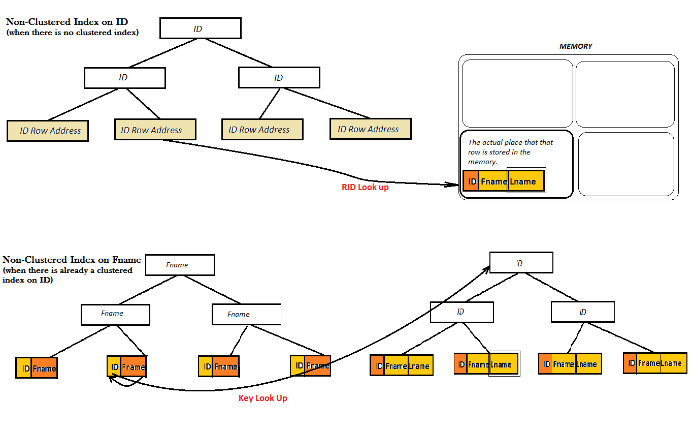
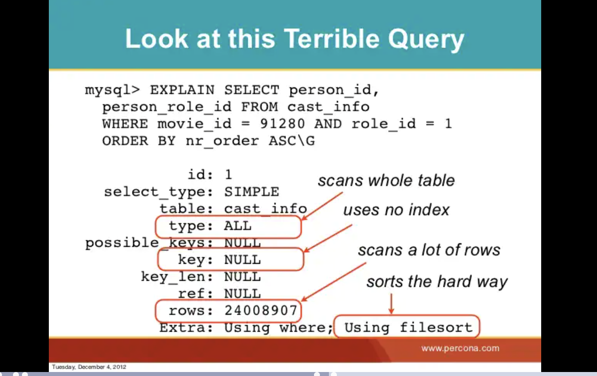

# RDBMS (esp MySQL)

## Textbook 

[SQL Antipatterns](https://www.r-5.org/files/books/computers/languages/sql/style/Bill_Karwin-SQL_Antipatterns-EN.pdf)

## Terms

### Natual Key

a unique column that has a business meaning such as SSN, email

### Surrogate Key

a unique column that does not has a business meaning such UUID, auto-increment

### Discriminator (Partial Key)

a column in a weak entity to be a partial key to be unique by combining with another columns. 

sounds like composit key?? what is the different??

### Weak Entity

an entity does not have a primary key attribute. 

### Temporary Table

a special type of table that allows you to store a temporary result set, which you can reuse several times in a single session.

this is very handy when it is impossible or expensive to query data that requires a single SELECT statement with the JOIN clauses. In this case, you can use a temporary table to store the immediate result and use another query to process it.

a temporary can keep the data in the table so you don't need to run the expensive query again. 

you can use the temporary table as a usual table withing the session. 

```
-- create a temporary table based on DDL
CREATE TEMPORARY TABLE credits(
    customerNumber INT PRIMARY KEY,
    creditLimit DEC(10,2)
);

-- create a temporary table based on queries
CREATE TEMPORARY TABLE top_customers
SELECT p.customerNumber, 
       c.customerName, 
       ROUND(SUM(p.amount),2) sales
FROM payments p
INNER JOIN customers c ON c.customerNumber = p.customerNumber
GROUP BY p.customerNumber
ORDER BY sales DESC
LIMIT 10;

-- you can use it as usual table.
SELECT 
    customerNumber, 
    customerName, 
    sales
FROM
    top_customers
ORDER BY sales;
```

reference: [here](https://www.mysqltutorial.org/mysql-temporary-table/)

### Views

Views are stored queries that when invoked produce a result set. A view acts as a virtual table.

```
-- create a view called 'accounts_v_members'
CREATE VIEW `accounts_v_members` AS SELECT `membership_number`,`full_names`,`gender` FROM `members`;

-- call the view
SELECT membership_number, full_names FROM accounts_v_members
```

- __every time__ you run the view, it gerenate the result on the view as a virtual table. 
- you can use views to make your query simple. if you have a complex select with lots of joins, you can implement it in a view and simply call the view without need to consider all these joins. You can then reuse this view.
- A view can provide a simple, public interface to a complex SELECT statement, so applications can just 'SELECT column-list FROM my-easy-view'.

reference: [here](https://www.guru99.com/views.html)

### full text search

Full-text search is a technique that enables you to search for records that might not perfectly match the search criteria.

### derived table

a verital table 

### Concurrency Handling

#### 2PL (2 Phase Locking) 

old type of concurrency handling employed by many relational database. this approach employes the strong locking so that you can avoid concurrency contention. But, the strong locking comes with a cost which is that making your system difficult to scale. if many clients need to access the data concurrently, they have to wait for the previous locking is released. So, the modern systems adapt to MVCC.

#### MVCC (Multiple Version Concurrency Control)

each transaction was assigned with unique id and if the tx modified a row, the tx id was recorded to the row. each row has a version of shapshot.

this is invented to minimize the locking to make systems more scalable.

?? read more documentation.

### Snapshot

database schema and its data at a given moment.

### Isolation Level

1. **Committed Read**: a 'select' statement in a transaction can read committed data from another transaction. you might see the different value with the same select statement since other transactions might modify the data.

use MVCC internally so other transactions can stil access to a row which is selected by another transaction.

Tx A: ----> SELECT (A) -------------------------------------> SELECT (A') --> 

Tx B: -----------------> SELECT (A) ---> UPDATED (A') -> COMMIT (A')

2. Repeatable Read: a 'select' statemebt in a transaction cannot see the any update from other transactions. your transaction see the same snapshop all the time even if other transactions. 

use MVCC internally so other transactions can stil access to a row which is selected by another transaction.

Tx A: ----> SELECT (A) -> UDPATE (A') ---------------> COMMIT (A')

TX B: -------------------------------> SELECT (A) --->

this might cause **Lost Update** (e.g., Last in Win), the first commit dissappeares when the 2nd one is commited (e.g., override the 1st commit).

Tx A: ---> SELECT (A) ---> UPDATE (A') ---> COMMIT (A')

Tx B: ---> SELECT (A) ----> UPDATE (B') ---------> COMMIT (B') // tx that commited last win and Tx A's commit was lost.

#### Consistent Read

a data on read opration is the same if a transaction was modified the data before commit.

Tx A: ---> Read data (D) ---> Update (D') ---------------------> Commit

Tx B: -----------------------------------> Read data (D) // still D even after Tx A changed it to D' but before commit.

## handling Concurrency with Low-Level package

see [this](https://stackoverflow.com/questions/17431338/optimistic-locking-in-mysql)

## Antipatterns

### Jaywalking

### Adjacency List

one-to-one relationship with the same table. this design is troublesome when you want to store the tree structure data (e.g., a comment has multiple comments and each child comment has mutliple comment too)

#### whey it bothers 

1. how to retrieve a particular level of nodes? you need to use mutliple join keyword based on the how much level of node you want to retrieve. (e.g., if you want to get a note which reside in 3 level, you need to use 3 join keywords.

#### solutions (how to store tree structure data in database the efficient way)

1. __Path Enumeration__ 

create a column and store the path. it represents hiarachy. for example, one row has '/a/b/c' in the column and another has 'a/b'. this represents that the 2nd row is the parent of the first row.

drawbacks:

  1. __no validation for the path column in database__. for example, if the parent path does not exists? you always have to validate the input in application side.

2. Nested Sets

create two columns called 'nsleft' and 'nsright' to locate the position of a node. 

there is a rule to create the Nested Sets. __the nsleft number is less than the numbers of all the node’s children, whereas the nsright number is greater than the numbers of all the node’s children. These numbers have no relation to the comment_id values__.

to find a particular node and its desendants, you need to use 'between' in 'where' condition and put 'nsleft' and 'nsright' value of the target node. 

updating the tree is more complex than other solutions. see textbook at 47 page. you need to recalculate 'nsleft' and 'nsright' value of all nodes. (sound like not practical)


3. Closure Tables

create a additional table besides comments table. then, store the relationship info (e.g., anscestor and descendant).

relatively easier than others esp Nested Sets for CRUD operation. 

### Primary Key When Needed

Are all tables required to have a primary key?

it is not mandatory that you have to use the primary key in every table. if you think you don't need the primary key, you don't need it. (e.g., can use compound keys on join table for many-to-many relationship)

### Entity-Attribute-Value (EVA) Design

a generalization of row modeling. the idea is that you try to records all of your data in this single table with columns called entity, attribute, and values.

ex)
| entity | attribute | value |
| ------- | --------- | ----- |
| person | id        | 1 |
| product | id       | 12 |
| cateory | name | 'shoes' |

#### Why Antipattern?

- you can't use data type. value can be any type otherwise, it lose its benefits.
- you can't use referential intergiry on attribute column. a value of attribute column can be anything. 

#### Solutions

- [Single Table Inheritance](#single-table-inheritance)
- [Concrete Table Inheritance](#concrete-table-inheritance)
- [Class Table Inheritance](#class-table-inheritance)
- [Semistructured Data (Serialized LOB)](#semistructured-data-serialized-lob)

## Techniques 

### Single Table Inheritance

create a inheritance with a single table. you accommodate all of fields in subclasses in a single table. 

ex) student and teacher subclasses are combined in 'person' table in database. 'gpa' column is only used by student and 'evaluation_score' is only used by teacher.

| id | name | type | gpa | evaluation_score | 
| ------- | --------- | ----- | ---- |
| 1 | 'john' | student | 3.4 | NULL |
| 2 | 'yoko' | teacher | NULL | 4.0 |
| 3 | 'satoshi' | teacher | NULL | 3.0 |

### Concrete Table Inheritance

create a separate table for each subclass, but this does not create a table for the superclass. therefore, the common fields are duplicated in each table for subclasses.

__table: teacher__
| id | name | evaluation_score | 
| ------- | --------- | ----- | 
| 1 | 'john' | 4.0 |
| 2 | 'yoko' | 5.0 |
| 3 | 'satoshi' | 3.0 |

__table: student__
| id | name | gpa | 
| ------- | --------- | ----- | 
| 1 | 'john' | 4.0 |
| 2 | 'yoko' | 5.0 |
| 3 | 'satoshi' | 3.0 |

### Class Table Inheritance

best?

mimic inheritance in database. create tables for a superclass and each subclasses.

the trick is use the same id in superclass and each subclass so that you know its subclass.

__table: person__
| id | name | 
| ------- | --------- | 
| 1 | 'john' |
| 2 | 'yoko' |
| 3 | 'satoshi' |

__table: student__
| id | gpa | 
| - | - | 
| 1 | 4.0 |
| 2 | 5.0 |
| 3 | 3.0 |

__table: teacher__
| id | evaluaton_score | 
| - | - | 
| 1 | 4.0 |
| 2 | 5.0 |
| 3 | 3.0 |

#### pros

- no duplication of columns

#### cons

- a little complciated sql statement (e.g., join) for SQL statement

### Semistructured Data (Serialized LOB) 

similar to [Single Table Inheritance](#single-table-inheritance), but you create a single column to store a set of attribute as JSON/XML so that you can serialize it at your applicaiton.

for example, 'attribute' column contains a json about additional keys and values based on the type (e.g., { gpa: 4.0, key1: value1, key2: value2 } for student type.

| id | name | type | attributes |
| - | - | - | - |
| 1 | 'john' | student | '{ gpa: 4.0 }' |
| 2 | 'yoko' | teacher | '{ evaluation_score: 3.0 }' |
| 3 | 'satoshi' | teacher | '{ evaluation_score: 4.2 }' |

#### pros

- extensible: you don't need to create additional columns if you need to add other fields.

#### cons

- you cannot use SQL features (e.g., query, where, and so on) on the 'attributes' column

### Polymorphic Association

this antipattern is used when you want to create multiple association for two different parent tables with a single foreign key. obviously, reference integrity does not allow you to store a single foreign key column from more than one tables.


### Metadata Tribbles

this antipattern is used when you want to prevent a single table from increase the number of row for performance (e.g., the more data in a table, the worse the performance). 

What this antipattern allows you to do is that you create a table per a range of a value on an attibute. for example, you create a table based on the year (e.g., 2000, 2001, 2002, and so on) to prevent performance degradation. 

#### Why Anitipattern?

- hard to manage primary key. you need to manage the uniqueness of primary key across those tables.
- hard to manage query. you have to use 'union' to connect those tables.
- cannot use the same foreign key for those tables.
- hard to add a new column. you need to add a new column for each table and must consistent name & data. 

#### Solutions

1. __horizontal partitioning (esp sharding)__: 

- create replicas (e.g., duplicate schema) and partition rows (e.g., ID: 1 - 100 goes to replica 1 and ID: 201 - 400 goes to replica2, and so on)

2. __vertical partitioning with dependent table__:

- split a table with columns (esp, you split columns which is seldom used). specifically, you identify the columns takes a large size and seprate those columns in a dependent table. you can use the primary key as a foreign key for the depedent table. 

the benefit is that you can exclude thoes large columns from the main table and when you do queries, it improve performance. 

### Rounding Errors

use DECIMAL or NUMERIC if you need a value to be precise. don't use FLOAT. 

by specification, FLOAT store its value on base-2 format and some number cannot be represented in base-2 format precisely so need to be rounded, so when you do calculation/comparison, it does not work as expected.

### Flavors

how to store enum in database?

this antipattern recommends you to use ENUM type or similar data type. 

#### Why Anitipattern?

- hard to update the data type. what if you want to add another value to the enum? you need to redefine the data type again
- less portability. what if other database brands don't support ENUM or have different data type to support ENUM. 

#### Solutions

- __create a table to store the enum values__: rather than using data type, you can create a table to keep track of your enum values. 

table: user_types
| id | name |
| - | - | 
| 1 | 'guest' | 
| 2 | 'member' | 
| 3 | 'admin' | 

benefits:

- good portability. if you migrate to another database brands, it is easy since this is just a table
- easy to update. if you want to add another value, you can use 'insert' statement. 

### Phantom Files

image storage should be in database or filesystem. 

this textbook said that it should be database because of the following reasons:

1. easy to update. deleting image in database is much easier than one in filesystem since you can delete it with 'delete' statement automatically.
2. easy to migrate. you can easily migrate database to another if images are included in database.
3. respect access priviledge. if you store images in database, you can apply the access priviledge to the columns since it is inside database.
4. easy to do TX. you can easily wrap with transaction and do rollback easily. 

However, many developers are for filesystems.

1. https://www.quora.com/Is-it-better-to-store-images-in-a-database-or-a-file-system
2. https://stackoverflow.com/questions/3748/storing-images-in-db-yea-or-nay

it is up to you which you prefer.

### Index Shotgun

use indecies properly for performance.

#### Anitipatterns

- __no index__: the main benefit of indeces is faster access your desired rows for SELECT, UPDATE, DELETE rather than full scan of a table. 
- __too many index__: adding extra index on the same column does not give you benefits.

1. primary key column: primary key has an index so you don't need to additinal index.

#### Solutions

- __use MENTOR (Measure, Explain, Nominate, Test, Optimize, Rebuild)__: 

1. __Measure__: identify which query causes performance problems. you can use 'slow.query.log' in MySQL. it is important to focus on that you can get great benefits by this performance tuning since if you focus on the column which is not used for queries often, you are wasting your time. 

2. __Explain__: identify why the target query is so slow. use __query execution plan (QEP)__ (e.g., in MySQL, it is 'EXPLAIN' keyword) 

3. __Nominate__: analyze and identify the candidates (e.g., columns) for the index

4. __Test__: test the index with queries. 

5. __Optimize__: enable cache.

6. __Rebuild__: perform maintanance regulary. this is because if you columns is changed (e.g., adding a new column, removing an existing column) affects performance of your index. in order to keep the good balance your index, regulary maintanance is mandatory.

#### Caveats When Performance Tuning

- disable cache (e.g., use 'EXPLAIN SELECT SQL_NO_CACHE <SELECT_LIST> FROM <TABLE_NAME> ...;' keyword when you test)
- enable profiling only when performance tuning so that you can get enough information for it and disable after you done the performance tuning.
- create an index on a column only you need. 
- test every case including INSERT, UPDATE, DELETE since adding indices make those statement worse.

### Fear of Unkown

NULL is different from the one in the most programming lanaguage (e.g., NULL is not FALSE, 0, or '').

### Ambiguous Group

#### Single Value Rule

when using 'GROUP BY', the all columns in the SELECT list must have a single value per the group. otherwise, the query does not return the proper result or throws an error. 

```
-- voilating Single Value Rule
-- 'id' does not have a single value per 'category' (e.g., 'fool' category has multiple distinct vlaues such as 1, 2, 3 and 'bar' has multiple disctinct values such as 4, 5 , 6)
create table foo (id serial primary key, category varchar(10));

insert into foo (category) values 
  ('foo'), ('foo'), ('foo'), ('bar'), ('bar'), ('bar');

select * from foo group by category;

+----+----------+
| id | category |
+----+----------+
|  4 | bar      |
|  1 | foo      |
+----+----------+
```

ref: [here](https://stackoverflow.com/questions/1645921/mysql-group-by-behavior)

#### Solution

make sure that you follow that Single Value Rules. 

you can use subquery, derived table, join, and aggregate operator (e.g., MAX, ...) to make other columns (e.g., 'id' in the above example) have a single distinct vlaue. 

### Random Selection 

how to return a single row randomly?

#### Solutions

__quick but bad performance when scal is bigger__: 

```
SELECT * FROM Bugs ORDER BY RAND() LIMIT 1;
```

ref: [here](https://stackoverflow.com/questions/580639/how-to-randomly-select-rows-in-sql)

__good performance even if scale is biggger (textbook recommendation)__: see textbook (p187)

### Poor Man's Search Engine

how to do full text search in database.

#### Antipattern

do it with LIKE. the horrible idea.

#### Solutions

use FULLTEXT index in MySQL

### Spaghetti Query

creating a one complicated query is good idea?

#### Antipattern

write a complex query at once.

#### Solutions

create a query step by step. 

if you need to return two different logic, create a simple query for each logic. don't need to combine them.

### Implicit Columns

use wildcard in SELECT is good?

#### Antipattern

use wildcard in that as many as possible. 

- hard to detect an error when change. if you use wildcard and when fetching the data in your app, it relies on the position when determineing the value rather than column name. this is not robust since adding a new column results in the inconsistency the position and you need to fix the position correctly.  
- bad for performance and scalability. this is because wildcard returns all of your columns even the one you actually don't need.

#### Solutions

use explicit columns. don't use wildcard. 


## index (with MySQL):
	- goal: to find data from a tables quickly. without index, you need to find the data from the beginning. 
	- analogy: indeces on a book
	- trade off between reading (SELECT) and writing (INSERT, UPDATE, DELETE). adding an index makes the reading faster and makes writing slower and vice versa. this is because index are used to speed up the reading. when the writing, it requires the engine to modify the index table too so that's why adding index makes the writing slower. 
	
### clustered index:
	- only one clustered index per table
	- sort the data rows in the table based on the indexed column
	- in RDBMS, usually primary key is a clustered index
	
### non-clustered index (secondary indexes):
	- stores the data at one location and indeces at another location. 
	- the index contains pointers to the location of that data.
	- a single table can have amny non-clustered indexes because an index in the non-clustered in dex is stored in different places. 
	- improve the performance of quieries that use keys which are not assigned as a primary key. 
	
### B-tree index: 
	tree structure that has many children. (*binary tree has only 2 children).
	enabling fast lookup for exact matches (equals operator) and ranges (for example, greater than, less than, and BETWEEN operators).
	available for most storage engines, such as InnoDB and MyISAM
	for primary key, unique, index, and fulltext 
	
  - multiple level indeces 
  
  * what is diff btw B-Tree vs B+tree

ref (youtube): https://www.youtube.com/watch?v=aZjYr87r1b8&ab_channel=AbdulBari
  
### hash index:
	intended for queries that sue equality operators (= or <=> (null safe))
	only available at "Memory" storage engines 
	
### FULLTEXT index:

enable full text search if a column has FULLTEXT index.

FULLTEXT can help with that query if bar is a "word". FULLTEXT handles words, not arbitrary substrings (as LIKE does).

in MySQL, there are three modes

1. __natural language search type__: search a given word in a text collection (one or more text columns) and sort by the highest relevance first.
2. __query expansion type__: frequently used when the user relies on implied knowledge - for example, the user might search for “DBMS” hoping to see both “MongoDB” and “MySQL” in the search results.
3. __boolean search type__: you can customize query with operators (e.g., you want to search "words" not but "word2")

### covering index: 

covering index: a special case of an index in InnoDB where all required fields for a query are included in the index; in other words, the index itself contains the required data to execute the queries without having to execute additional reads.

simply said that if your columns in your query does not include, the engine need to refer to the original table besides the index. this makes performance worse if you don't include the columns in the index since it need to lookup the index (non-clustered) and the primary index (clustered). 

in order to prevent this, you can use covering index. you just need to include the columns in the index when creating the index.

the below image shows that if you don't have clustered index, which means that you only have non-clustered index, you don't need to care about covering index. However, if your table include clustered index and non-clustered index, it might causes this problem and you need to use covering index to solve it.



ref: [here](https://www.softel.co.jp/blogs/tech/archives/5139) (experiment)
ref: https://stackoverflow.com/questions/609343/what-are-covering-indexes-and-covered-queries-in-sql-server (image)

### the star system

this system show the effectiveness of your index. 

here is an example of terrible query which turns a wonderful query after applying this system.



1. one star: rows referenced by the query are grouped by together in the index

pick all columns used in equality preficate (e.g., where xxx = yyy ) and those columns are condidates for your index.

2. two star: rows referenced by the query are ordered in the way you want them 

pick all columns used in GROUP BY/ORDER BY and those columns are also condidates for your index.

3. three star: covering index

add all columns used in SELECT and those columns are also candidates for your index.

the result would be:

```
CREATE INDEX wonderful_index on sample_table
(star1_column..., star2_column..., star3_column...)
```

* note: there is a lot of exceptions so please review [this power point](https://www.slideshare.net/billkarwin/how-to-design-indexes-really) when implement.

### Tips

1. don't use LIKE keywrod to search a text. use FULLTEXT search index for performance gains
2. the order of columns in a index matters. if you include the first column of the index in where/group by/order by clause, you can get benefits from the index, otherwise you cannot get benefits.

```
-- index 1
CREATE INDEX sample_index ON sample_tables (column1, column2, column3);

-- you CAN get benefits from the above index for the following query

SELECT * FROM sample_tables
WHERE column1 = 'XXX' -- column1 is the first column in the index so you can get benefit
AND column2 = 'YYY';

-- you CANNOT get benefits from the above index for the following query

SELECT * FROM sample_tables
WHERE column3 = 'XXX' -- colum1 is not included in the query so you cannot get the benefits
AND column2 = 'YYY'; 

-- index 2
CREATE INDEX sample_index ON sample_tables (column3, column2, column1);

-- you CANNOT get benefits from the above index for the following query

SELECT * FROM sample_tables
WHERE column1 = 'XXX' -- column3 is not included in the index so no benefits
AND column2 = 'YYY';

or 

SELECT * FROM sample_tables
WHERE column2 = 'XXX' -- only single colum which is not the first column the index does not help

-- you CAN get benefits from the above index for the following query

SELECT * FROM sample_tables
WHERE column3 = 'XXX' -- column3 is the first column so you can get benefit
AND column2 = 'YYY';

```

### filesort

you see 'using filesort' when you run a query with 'EXPLAIN'. this means that the engine need to sort the result since the natural order does not respect for the your query. this takes longer time to finish. 

ref: [here](https://stackoverflow.com/questions/65912380/what-does-using-filesort-mean-in-mysql)

## Preloading Index

Preloading enables you to put the table index blocks into a key cache buffer in the most efficient way: by reading the index blocks from disk sequentially.

i don't completely understand but it sounds like that when start MySQL, you can effectively access indices because of this preloading (e.g., put the information about the indices on the cache rather than hard disk).

ref: [here](https://dev.mysql.com/doc/refman/8.0/en/index-preloading.html)

## Optimizing Table

if you do a lot of UPDATE/DELETE, it might lead fragmentation in your MySQL data file. in this case, you can use 'OPTIMIZE TABLE' command to fix the fragmentation and recover the unused space. 

ref: [here](https://www.techbeamers.com/mysql-optimize-table/)

## storage engines:
	- MyISAM
	- InnoDB
	- Memory

## Horizontal scaling: 

add more machines

## Vertical scaling 

add more powerful RAM, CPU

## Scaling up options

### Scaling up hardware

increase CPU, RAM, and so on (vertical scalling)

### Add replicas (could be problematic): add master (e.g., receive the write/read request from your app and coordinate slaves) and slave (replicas) 

- The disadvantage of replicas: eventual consistency might cause read access to get stale data. For example, after a write access to the master and still updating each slave for the write request, another request for the read reads the stale data from one of the slave. 

### Sharding (better solution? Too complicated):

Prepare the total n number of databases (called S1, S2, …, SN) and store a part of your data in each shard database. For example, data of customer id 1 to 50 is stored in S1, and data of customer id 51 to 100 are stored in S2, and so on. 
Need a logic (mapping table or another database to identify which customer id is stored in which shard database)


## Basics

### TIMESTAMP VS DATETIME

__TIMESTAMP__: with time zone info

- convert this TIMESTAMP values from the current time zone to UTC for storage and back from UTC to the current time zone for retrieval.

- you need to set time zone for MySQL to adjust if rather than UTC

__DATETIME__: no time zone info

### Display Proper DateTime for Each Client

1. store TIMESTAMP (UTC) in database
2. display the date and time in client time (browsers)

ref: https://stackoverflow.com/questions/2251780/php-ini-date-timezone-server-or-client-location-time-zone
ref: https://stackoverflow.com/questions/10834665/how-can-i-handle-time-zones-in-my-webapp

- questions)
- how to save the timestamp with java data type?
- is it ok to use LocalDateTime and can transmit it to mysql TIMESTAMP type?
- see this: https://mkyong.com/java8/java-8-convert-localdatetime-to-timestamp/

### WHERE VS HAVING

- WHERE: filters data before select.

- HAVING: filters resulting data after select.

ref: https://stackoverflow.com/questions/2905292/where-vs-having/18710763#18710763

### LEAST vs MIN

- LEAST: you can compare multiple columns,

- MIN: you can only compare a single column

### How to exclude NULL from min, max, sum ...

- Coalesce:

return the first non-null value in a list of arguments.

- use IFNULL.

e.g., greatest(IFNULL(column1, 0), ...)

ref: https://stackoverflow.com/questions/3078370/how-to-find-least-non-null-column-in-one-particular-row-in-sql

### Distinct vs Group By

distinct: used to remove duplicated rows, so not duplicated row is never deleted.

group by: equivalent to 'Distinct'

### Cartesian Product (a.k.a CROSS JOIN)

you can think of Cartisan Product in Math. list of all possible combination of two tables.

generally, it is considered bad since it generates a lot of redundancy rows.

syntax) SELECT * from table_a, table_b or SELECT * from table_a CROSS JOIN table_b 

ex) see this: https://www.w3resource.com/mysql/advance-query-in-mysql/mysql-cross-join.php


## Locking (MySQL)

when multiple connections try to access the same table/row, you might have unexpected result. 
you can do the followings depending on your use cases:

1. **FOR SHARE**: 

- use when a connection/transaction allows others to use the row/table which the connection is using. 
- the others can read the data but have to wait for the main connection/transaction commit/rollback.

2. **FOR UPDATE**:

- use when a connection/transaction nto allows others to access the row/table which the connection is using.
- the others cannot read the data but have to wait for the main connection/transaction commit/rollback.

if the target table has unique (e.g, primary key column), it will lock the row. Otherwise, it will lock the whole table.

references:

1. [experiment of locking](https://stackoverflow.com/questions/6066205/when-using-mysqls-for-update-locking-what-is-exactly-locked)
2. [Go with Mysql Locking]()


## Design Process

## RDBMS (MySQL) 

design and implement RDBMS.

1. create tables with fields based on the requirment.
2. identify the relationship
  - One-To-One: put a foreign key field on "One" table, use same primary key on both tables, or embed "One" table to another so you don't need to use the relationship.
  - One-To-Many: put a foreign key field on "Many" table.
  - Many-To-Many: create a join table and put primary key of both tables into the join table as foreign keys
3. identify the cascading (e.g., how to deal with child tables when the parent is updated/deleted)
4. identify the index to boost performance.
